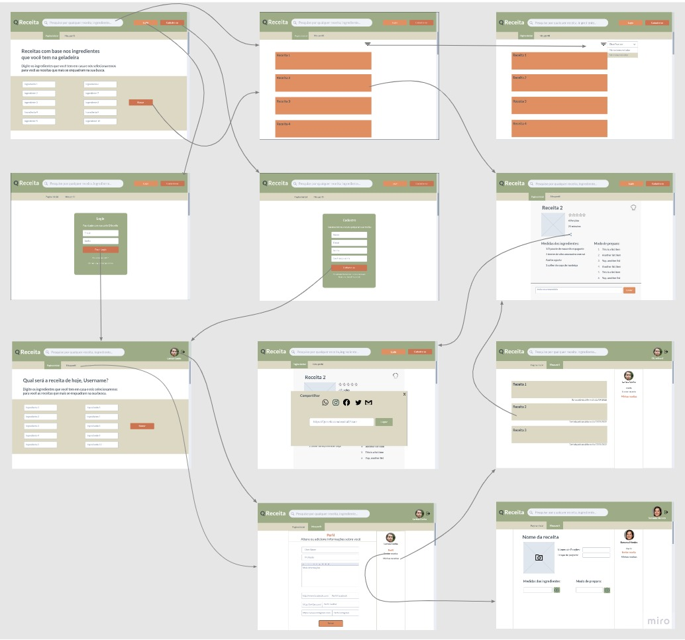
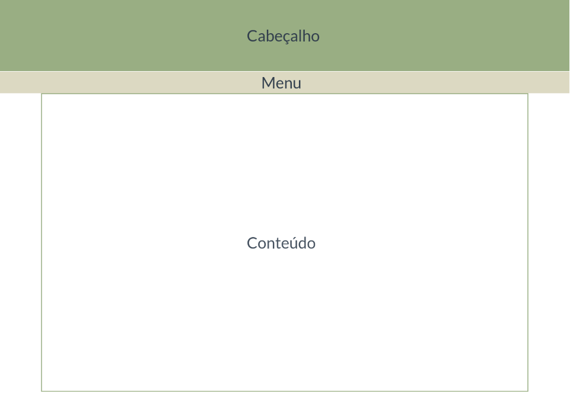
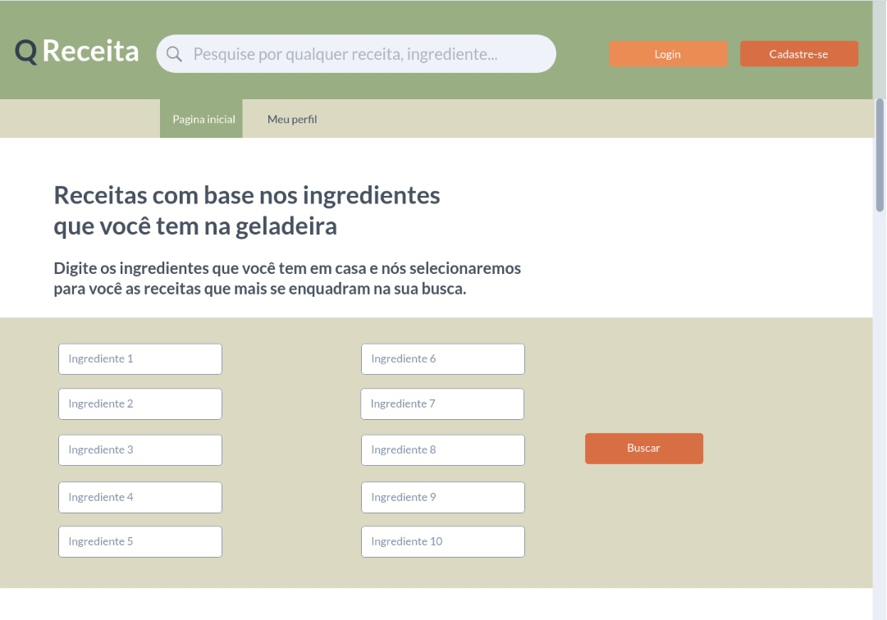
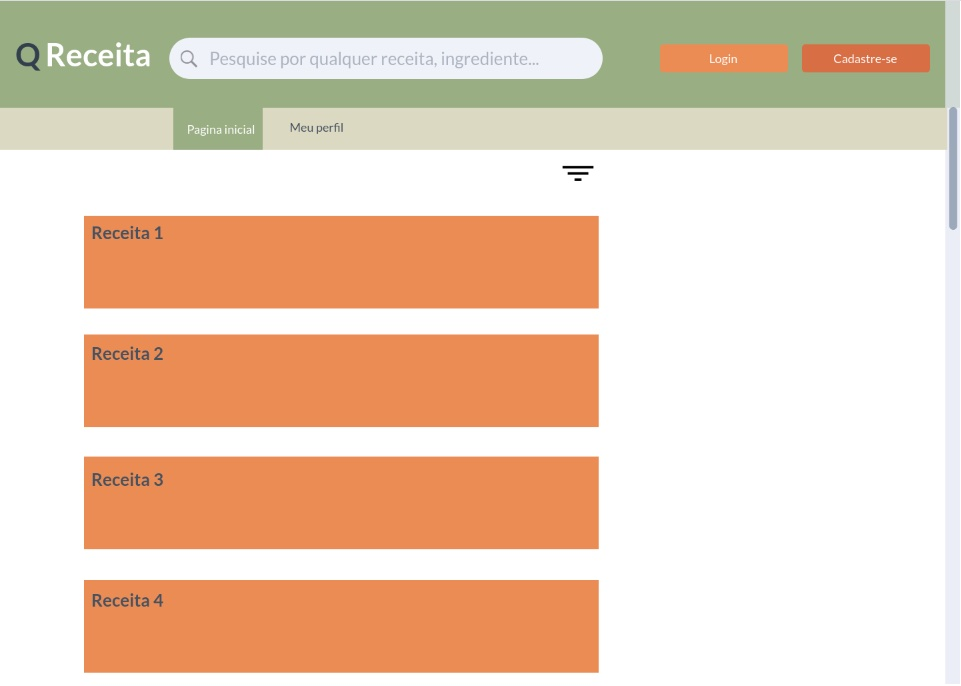
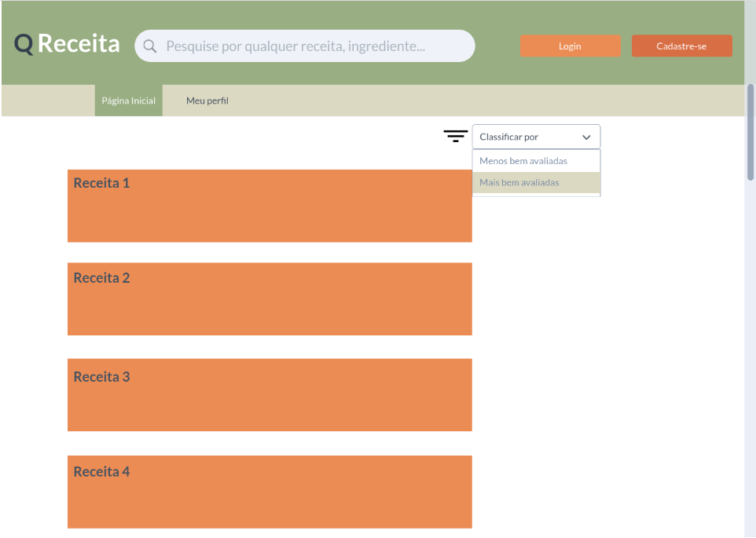
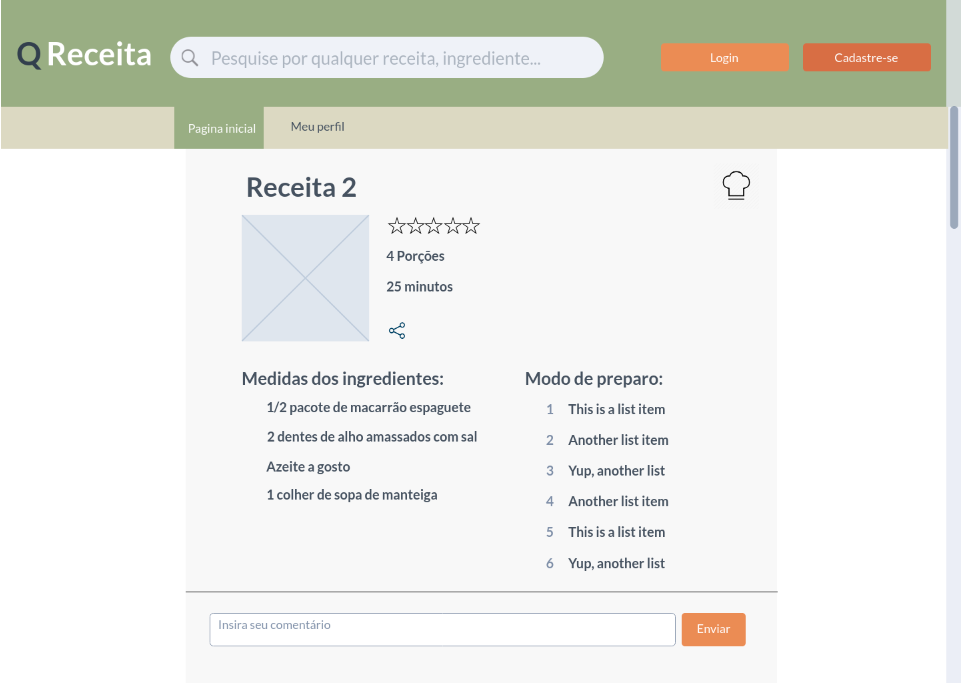
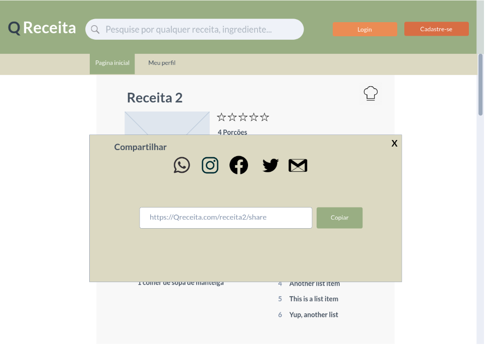
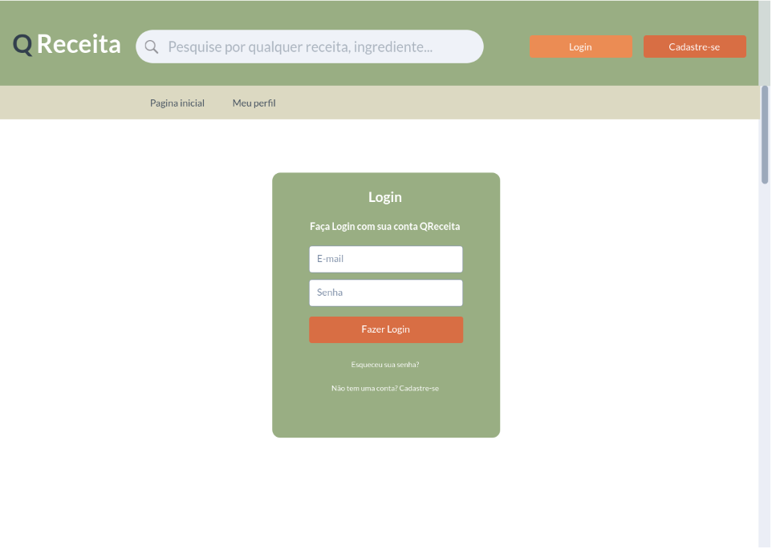
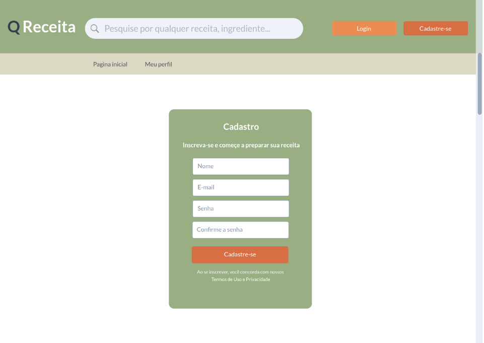
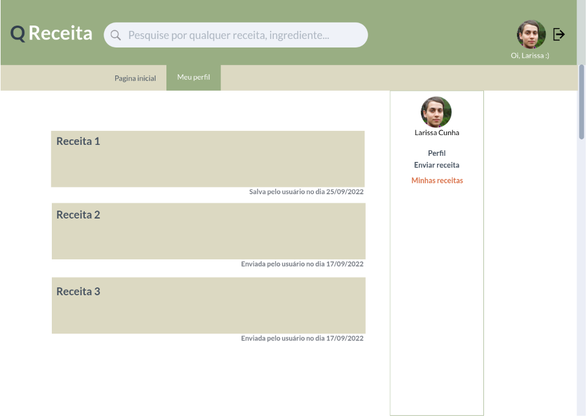

# Projeto de Interface

Dentre as preocupações para a montagem da interface do sistema, estamos estabelecendo foco em questões como agilidade, acessibilidade e usabilidade. Desta forma, o projeto tem uma identidade visual padronizada em todas as telas que são projetadas para funcionamento em desktops e dispositivos móveis.

## User Flow

O diagrama apresentado na Figura 2 mostra o fluxo de interação do usuário pelas telas do sistema. Cada uma das telas deste fluxo é detalhada na seção de Wireframes que se segue. Para visualizar o wireframe interativo, acesse o <a href="https://marvelapp.com/project/6437467">Ambiente MarvelApp do projeto</a>

Figura 2 - Fluxo de telas do usuário

## Wireframes

Conforme fluxo de telas do projeto, apresentado no item anterior, as telas do sistema são apresentadas em detalhes nos itens que se seguem. As telas do sistema apresentam uma estrutura comum que é apresentada na Figura 3. Nesta estrutura, existem 3 grandes blocos, descritos a seguir. São eles:

  ● Cabeçalho - local onde são dispostos elementos fixos de identidade (logo), barra de pesquisa geral e botões de Login e Cadastre-se;

  ● Menu - neste bloco estão dispostos a estrutura de navegação principal do site (menu da aplicação);

  ● Conteúdo - apresenta o conteúdo da tela em questão;

  

Figura 3 - Estrutura padrão do site

Tela - Página Inicial

A tela de Página Inicial traz uma barra de pesquisa geral por nome de Receita ou Ingrediente no seu cabeçalho, dando alternativa ao usuário caso ele queira pesquisar algo específico a qualquer momento da sua navegação sem precisar retornar à Tela Inicial. Ao lado da barra de pesquisa são disponibilizados os botões Login (para usuários já cadastrados) e Cadastre-se (para usuários que desejam se cadastrar).
Com base na estrutura padrão, o bloco Menu traz os atalhos para acesso à Página Inicial e ao Meu Perfil que permite ao usuário uma maior agilidade na navegação. 
Por sua vez, o bloco de Conteúdo mostra uma mensagem de destaque dando ênfase na proposta do site e na sequência traz os campos dos ingredientes a serem informados pelo usuário para que a pesquisa seja realizada no Sistema. 

Figura 4 - Página Inicial

Tela - Lista de Receitas Encontradas

A tela de Lista de Receitas Encontradas traz no Bloco de Conteúdo as receitas,  priorizando aquelas que compreendem todos os ingredientes inseridos na pesquisa e na sequência aquelas que têm parte dos ingredientes. 

Figura 5 - Lista de Receitas Encontradas

Tela - Ranqueamento de receitas encontradas

Ao clicar no ícone de filtragem, aparecerão as opções de classificação das receitas Mais bem avaliadas e por aquelas Menos avaliadas.

Figura 6 - Ranqueamento de receitas encontradas

Tela - Receita Escolhida
Ao selecionar a Receita apresentada pela pesquisa o site abrirá esta página com o detalhamento dessa Receita, trazendo:
  ● medida dos ingredientes;
  ● modo e tempo de preparo;
  ● serve quantas pessoas;
  ● uma imagem do prato;
  ● possibilidade de atribuir uma avaliação da receita;
  ● possibilidade de incluir comentários;
  ● possibilidade de compartilhar a receita;
  

Figura 7 - Tela de Receita Escolhida

Tela - Compartilhamento da Receita

Nessa tela o usuário tem 5 opções de compartilhamento da receita, sendo via Whatsapp, Instagram, Facebook, Twitter e Gmail. Esta tela é exibida na forma de uma janela modal. Deve-se copiar o link informado e selecionar umas das plataformas para compartilhamento.

Figura 8 - Tela de compartilhamento de receitas

Tela - Fazer Login

Uma vez que usuário queira Avaliar ou Comentar a Receita, o site pedirá que ele faça o Login como usuário cadastrado.

Figura 9 - Tela de Fazer Login

Tela - Cadastre-se

Caso o usuário ainda não tenha realizado o seu cadastro, abrirá uma nova página no qual ele fará de forma simples o seu registro de usuário, contendo: nome, e-mail, a criação e validação de uma senha.

Figura 10 - Tela de Cadastre-se

Tela - Pesquisa por usuário Logado

A tela de pesquisa com o usuário logado, segue a mesma estrutura do site, porém apresenta no canto superior à direita é apresentada uma foto desse usuário (caso tenha inserido no seu perfil) e o seu username. Já no bloco de Conteúdo a frase “Receitas com base nos ingredientes que você tem na geladeira” dá lugar a “Qual será a receita de hoje, (Username)? dando um caráter mais interativo com esse usuário.

Figura 11 - Tela do usuário após o cadastro

Tela - Perfil do Usuário

A Tela de Perfil do Usuário apresenta a opção de alteração ou adição de informações pessoais. Nela, ele informa seu Nome, sua Profissão, adiciona alguma informação complementar sobre ele e seu perfil no Facebook, Twitter e no Instagram. Além disso, o Usuário tem a opção de adicionar uma foto no pequeno menu da lateral direita que ficará visível durante toda sua experiência na plataforma no canto superior direito como opção de retorno a tela de Perfil.

Figura 12 - Tela de Perfil do Usuário

Tela - Incluir Receitas

A tela de Incluir Receitas apresenta uma barra de texto para que o usuário possa inserir o nome da receita. Logo abaixo, existe a opção de adicionar uma fotografia do prato preparado, e na lateral uma opção para inserir a quantidade de porções que a receita serve e também uma opção de informar o tempo de preparo. Na informação Medida dos Ingredientes e Modo de Preparo, a cada novo ingrediente/modo, é necessário o usuário clicar no ícone +, ao lado, para que uma nova barra de digitação seja inserida abaixo da anterior.

Figura 13 - Tela de Inclusão de Receitas

Tela - Minhas Receitas

A tela de Minhas Receitas apresenta no seu Bloco de Conteúdo a listagem das Receitas Salvas/Favoritadas e aquelas que foram incluídas pelo usuário, mantendo-se assim um cadastro pessoal dentro do seu perfil.

Figura 14 - Tela de Minhas Receitas

