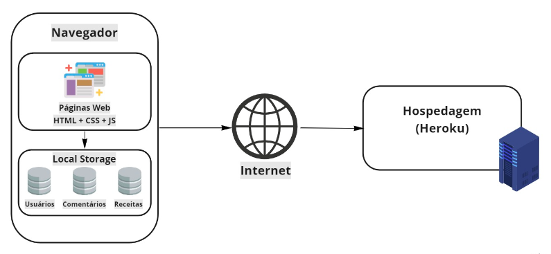

# Arquitetura da Solução

Pré-requisitos: <a href="04-Projeto de Interface.md"> Projeto de Interface</a>

Nesta seção são apresentados os detalhes técnicos da solução criada pela equipe, tratando dos componentes que fazem parte da solução e do ambiente de hospedagem da solução.

## Diagrama de componentes

Os componentes que fazem parte da solução são apresentados na Figura que se segue:

Figura 15 - Arquitetura da Solução

A solução implementada conta com os seguintes módulos:
● Navegador - Interface básica do sistema
  ○ Páginas Web - Conjunto de arquivos HTML, CSS, JavaScript, imagens e gifs que implementam e compõem as funcionalidades do sistema.
  ○ Local Storage - armazenamento mantido no diretório da aplicação, onde são implementados bancos de dados baseados em JSON. São eles:
    ■ Usuários - registro de informações (ID, nome, e-mail, senha, receitas favoritas, receitas postadas, redes sociais inseridas e informações adicionais) sobre os       usuários cadastrados
    ■ Comentários - registro de opiniões dos usuários sobre as receitas
    ■ Receitas - lista de receitas e informações associadas (ingredientes, modo de preparo, avaliações, porções, imagem, tempo de preparo e usuário)
● Hospedagem - local na Internet onde as páginas são mantidas e acessadas pelo navegador.

Inclua um diagrama da solução e descreva os módulos e as tecnologias que fazem parte da solução. Discorra sobre o diagrama.

## Tecnologias Utilizadas

Serão utilizadas na aplicação as seguintes tecnologias: JavaScript, HTML, CSS, Visual Studio Code.

## Hospedagem

O site utiliza a plataforma do Heroku como ambiente de hospedagem do site do projeto. O site é mantido no ambiente da URL:
 
https://link_exemplo.herokuapp.com
 
A publicação do site no Heroku é feita por meio de uma submissão do projeto (push) via git para o repositório remoto que se encontra no endereço:
https://github.com/ICEI-PUC-Minas-PMV-ADS/pmv-ads-2022-2-e1-proj-web-t4-qreceita
